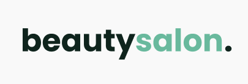

    

# NLW - Origin: OriginSix
Projeto desenvolvido na semana da NLW realizada pela **Rocketseat 🚀** com intuito de promover um projeto do zero!

    <a href="#-sobre">Sobre</a> •
    <a href="#-features">Features</a> •
    <a href="#-imagens">Imagens</a> •
    <a href="#-tecnologias">Tecnologias</a> •
    <a href="#-licença">Licença</a> •
    <a href="#-autor">Autor</a>

---

## 💬 Sobre

    O projeto foi realizado na semana da NLW - Together (20/06 até 27/06), trouxe o <b>OriginSix</b> que consistia em construir um site <i>One Page</i>, podendo modificá lo por inteiro, dependendo da finalidade do mesmo.

    

---

## ⚙️ Features

- [x] Rolamento de página por seção clicada
- [x] Smooth scroll
- [x] Barra de navegação hamburguer
- [x] Site responsivo
- [x] Links ativos
- [x] Botão back to top

---

## 📷 Imagem

    <strong>Uma pequena amostra de como fica o site:</strong>
    

---

## 🗃️ Tecnologias

Este projeto foi desenvolvido com as seguintes tecnologias:
* HTML
* CSS
* JavaScript

### Bibliotecas
* [Google Fonts](https://fonts.google.com/)
* [SwipeJS](https://swiperjs.com/)
* [ScrollReveal](https://scrollrevealjs.org/)

### Utilitários
  * [randomuser.me](https://randomuser.me/photos)
  * [IcoonMoon](https://icomoon.io/)

---

## 📁 Licença
Esse projeto está sob a licença MIT. Veja o arquivo [LICENSE](https://github.com/gabrlcj/nlw-together-origin/blob/bb6fa4cc658936665aef310a69c7a38665624762/LICENSE) para mais detalhes.

---

## 👨🏽‍💻 Autor

<b>Gabriel Bittencourt Penteado 🔰</b>

Feito com 🤎 por Gabriel B. Penteado. Entre em contato! 👋🏽

