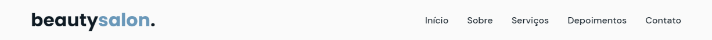
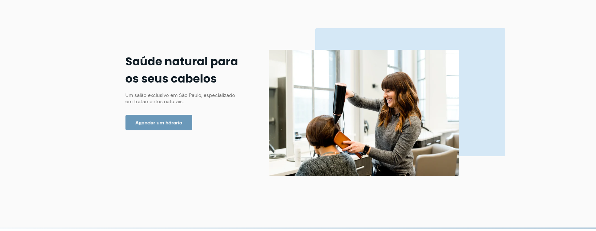
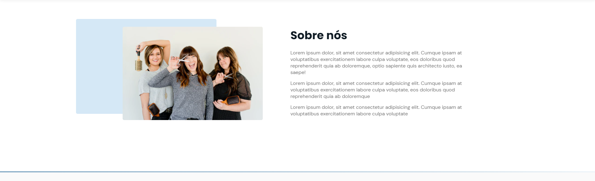
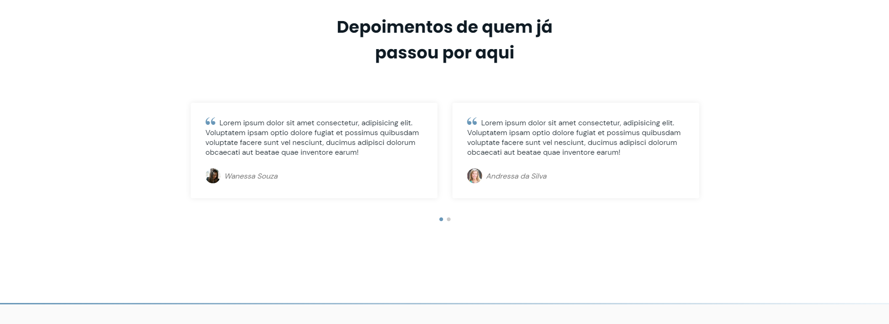
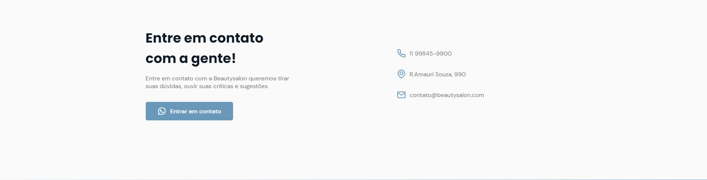
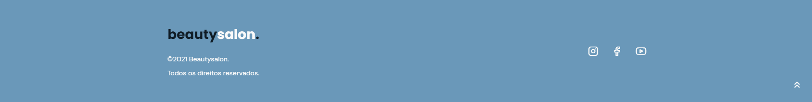

    

# NLW - Origin: OriginSix
Projeto desenvolvido na semana da NLW realizada pela **Rocketseat 🚀** com intuito de promover um projeto do zero!

    <a href="#sobre">Sobre</a> •
    <a href="#features">Features</a> •
    <a href="#imagens">Imagens</a> •
    <a href="#tecnologias">Tecnologias</a> •
    <a href="#licença">Licença</a> •
    <a href="#autor">Autor</a>

---

## 💬 Sobre
<h4>
    O projeto realizado na semana da NLW (20/06 até 27/06), trouxe o <stong>OriginSix</strong> que consistia em construir um site <i>One Page</i>, podendo modificá lo por inteiro, dependendo da finalidade do mesmo.
</h4>

    

---

## ⚙️ Features

    - [x] Rolamento de página por seção clicada
    - [x] Smooth scroll
    - [x] Barra de navegação hamburguer
    - [x] Site responsivo
    - [x] Links ativos
    - [x] Botão back to top

---

## 📷 Imagens

    <strong>Seção Home:</strong>
    
    <strong>Seção Sobre:</strong>
    
    <strong>Seção Serviços:</strong>
    
    <strong>Seção Depoimentos:</strong>
    
    <strong>Seção Contato:</strong>
    
    <strong>Footer:</strong>
    

---

## 🗃️ Tecnologias

Este projeto foi desenvolvido com as seguintes tecnologias:
    * HTML
    * CSS
    * JavaScript

### Bibliotecas
    * [Google Fonts](https://fonts.google.com/)
    * [SwipeJS](https://swiperjs.com/)
    * [ScrollReveal](https://scrollrevealjs.org/)

### Utilitários
    * [randomuser.me](https://randomuser.me/photos)
    * [IcoonMoon](https://icomoon.io/)

---

## 📁 Licença
Esse projeto está sob a licença MIT. Veja o arquivo [LICENSE](https://github.com/gabrlcj/nlw-together-origin/blob/bb6fa4cc658936665aef310a69c7a38665624762/LICENSE) para mais detalhes.
